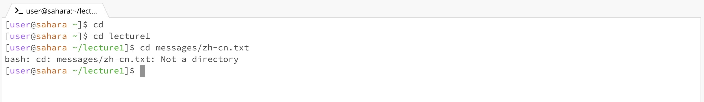
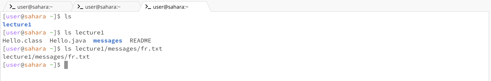
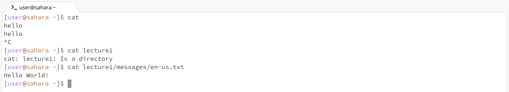

# Lab Report 1 - Remote Access and FileSystem (Week 1)

## `cd` command

The **first** command is an example of the `cd` command with no arguments. 
   When that command was run, the working directory was `home`. The working directory did not change when I ran the command because when no argument is present in the command line, Java takes it as `home`. So, the working directory remained as home. There was no output error.
  The **second** command is an example of the `cd` commaand being used with a *directory* as an argument.
   When the command was run, the working directory was `/home/lecturel` because the cd command changed the current directory, `home`, to the argument, `lecture1`. The output is not an error.
  The **third** command is an example of the `cd` command with a path to a *file* as an argument.
   When the command was run, the working directory was still `/home/lecturel` because the argument being a path to a file is not correct. 
   The arguments given to the `cd` command can only be directories, not files. The command outputted an error because of this. 

## `ls` command

The **first** command is an example of the `ls` command with no argument. `home` was the working directory when the command was run. The output in the system was `/home/lecturel`, meaning that it is the folder in the given path. Because there was no argument given to the command, the path the command looked in was where it already was, this case being `home`. There was no error.
  The **second** command is an example of the `ls` command with a *directory* as an argument. When this command was run, the working directory was still `home`, but since there is now an argument in front of the `ls` command, it is being told to look specifically into one path for the files and folders in it. So, the output was a list of the files and folders in `/home/lecturel`. This output was not an error.
  The **third** command is an example of the `ls` command with a path to a *file* as an argument. The working directory is still `home`. My output this time was not an error despite being unusual. It only printed out the path given in the argument instead of all the files and folders in the given path because that was all the command was given at the time.
   

## `cat` command

The **first** command is an example of the `cat` command with no arguments. `home` was the working directory as this command ran. The output produced errors because the command was given nothing to read. So instead anything typed after the intial no argument would be returned back in the terminal. To leave this command, I had to manually do control C.
  The **second** command is an example of the `cat` command with a *directory* as an argument. The working directory was still `home` when this command was run. The output produced an error because the argument given was a directory and the `cat` command reads files, so it needs to be given a specific path to a file, not one just ending at a directory.
  The **third** command is an example of the `cat` command with a path to a *file* as an argument. The working directory is still `home`. The output was not an error as it printed out the contents in the `en-us.txt` file. This output was correct as the `cat` command is supposed to print out whatever is in the given file. 
