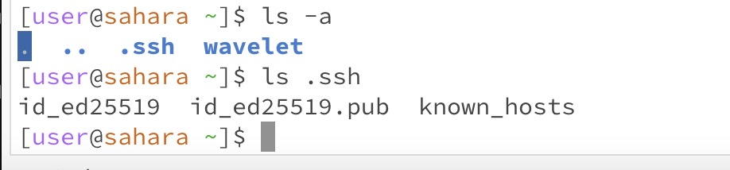
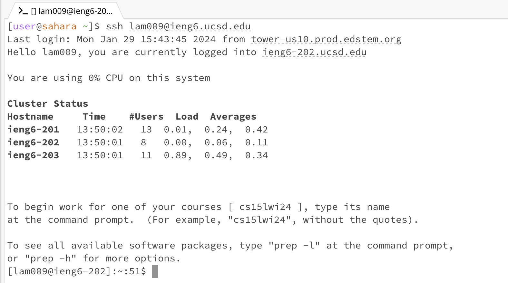
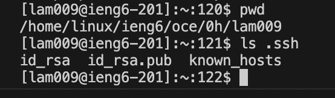

# Lab Report 2 - Servers and SSH Keys (Week 3)

## Part 1

 
 For this screenshot, the `HandleRequest` method in the `Handler` class was called. The URL was the argument to this method. Fields in the `Handler` class included a `String ArrayList` called `words`. It was initialized to be empty. In the `handleRequest` method there's 3 fields: `String result`, `String[] msg`, `String[] finalMsg`. `result` was initialized to be empty. The two elements in the `msg` array were set to the URL that was split into two parts, divided by "=". The two elements in the `finalMsg` array were set to the second element in the `msg` array that was split between "&user=". Then, the elements are added to the `words` ArrayList in the correct display format. Finally, every element in the `words` ArrayList is added to the `result` String, to make one big text block to print. The `URI` parameter field changes on each instance of the method being called as it takes in a new message each time.
  
 For this screenshot, the `HandleRequest` method in the Handler class was called. The URL was the argument to this method and the same fields remained, a `String ArrayList words` and a `String result`. However, one of the fields is not empty now. The `words` ArrayList has an element holdinng the previous name and message and doesn't get updated till the end of the method where a new message is added to it. The `String result` is empty at the start of the method again. The `String[] msg` is initialized to the `URI url` parameter that is split between "=". The two elements in `String[] finalMsg` is initalized to the second element that is split between "&user=". The two elements in `String[] finalMsg` is added to `ArrayList words` and every element in `words` is added to `String result`, forming one big chunk of text to print all at once. `result` is then returned. The `URI` parameter changes to the new URL as the method is called.

  
## Part 2

 The image above depicts the absolute path, `/home/linux/ieng6/oce/0h/lam009/.ssh/id_rsa`, to the private key for my SSH key logging into `ieng6` and the absolute path, `/home/linux/ieng6/oce/0h/lam009/.ssh/id_rsa.pub `, to the public key for my SSH key logging into `ieng6`.
 

 The image above depicts a terminal interaction I had where I did not have to enter in the password when using the `ssh` command.
 

 The image above shows the absolute path of the public and private key once I am logged into `ieng6`.

  
## Part 3
 I learned about the `ssh` command which I had no idea of before. I learned how we can connect to different servers to execute programs and how to switch the server I am connected to because it was a malfunctioning one. I also learned how to open browsers linked to specific ports depending on what I type in the terminal.
