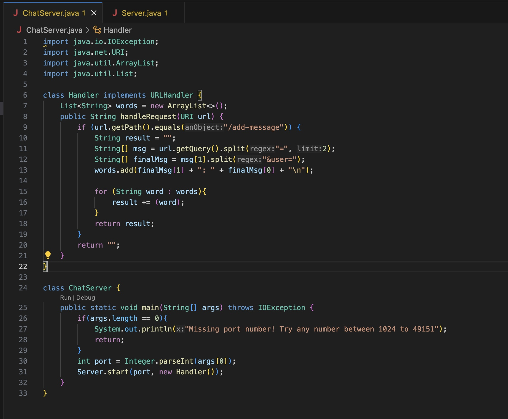
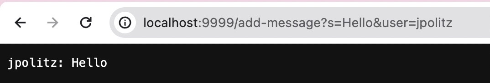
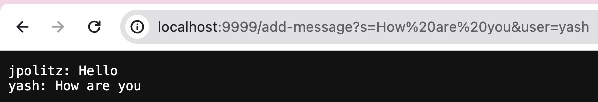
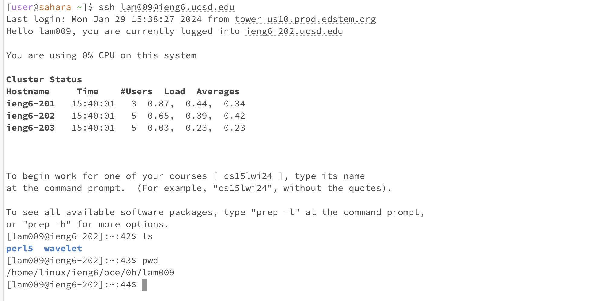

# Lab Report 2 - Servers and SSH Keys (Week 3)

## Part 1

 
 For this screenshot, the HandleRequest method in the Handler class was called. The URL was the argument to this method. Fields in the Handler class included a String ArrayList called words and a field in the HandleRequest method was a String called result. Both were initialized to be empty, but that would change as the method ran. First the message would be put into the ArrayList and then the string would take every element out of the ArrayList and make it one big text block to print. The URI parameter field changes on each instance of the method being called as it takes in a new message each time.
  
 For this screenshot, the HandleRequest method in the Handler class was called. The URL was the argument to this method and the same fields remained, a words String ArrayList and a result String. However, only one of the fields are empty now. The ArrayList has the previous message in it and doesn't update till the method runs and adds the new message to it, but the result String is empty, waiting for the updated ArrayList to be appended to it. The URI parameter changes to the new URL as the method is called.

  
## Part 2

 The image above depicts the absolute path, `/home/linux/ieng6/oce/0h/lam009`, to the private key for my SSH key logging into `ieng6`.

 
The image above depicts the absolute path, `/home/linux/ieng6/oce/0h/lam009 `, to the private key for my SSH key logging into `ieng6`.

  
## Part 3
 I learned about the `ssh` command which I had no idea of before. I learned how we can connect to different servers to execute programs. I also learned how to open browsers linked to specific ports depending on what I type in the terminal.
