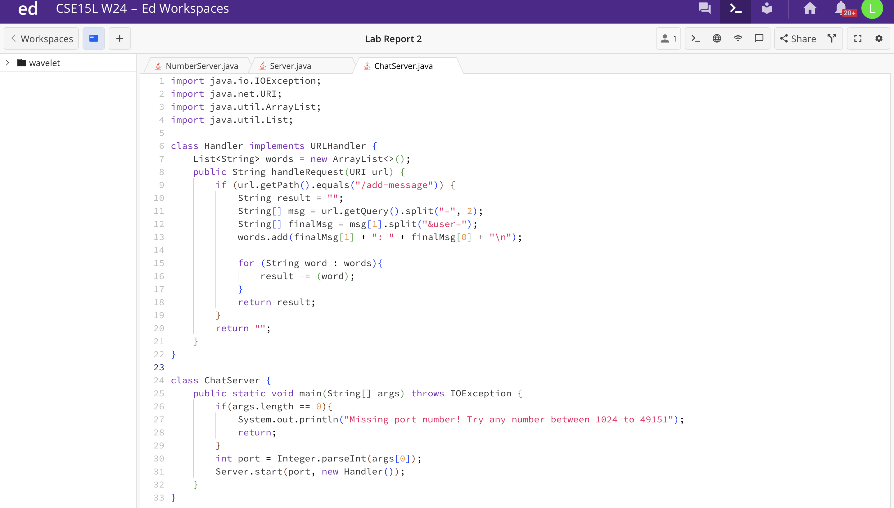
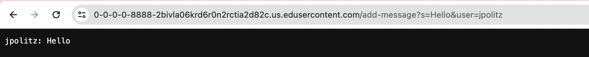
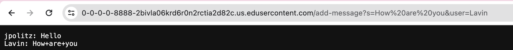

# Lab Report 2 - Servers and SSH Keys (Week 3)

## Part 1

 
For this screenshot, the HandleRequest method in the Handler class was called. The URL was the argument to this method. Fields in the Handler class included a String ArrayList called words and a field in the HandleRequest method was a String called result. Both were initialized to be empty, but that would change as the method ran. 
 
