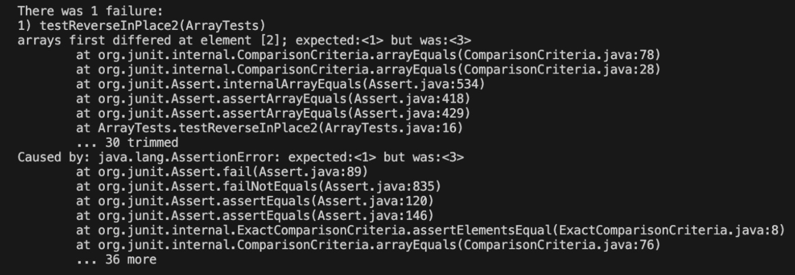
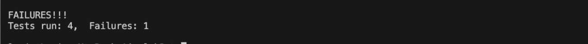
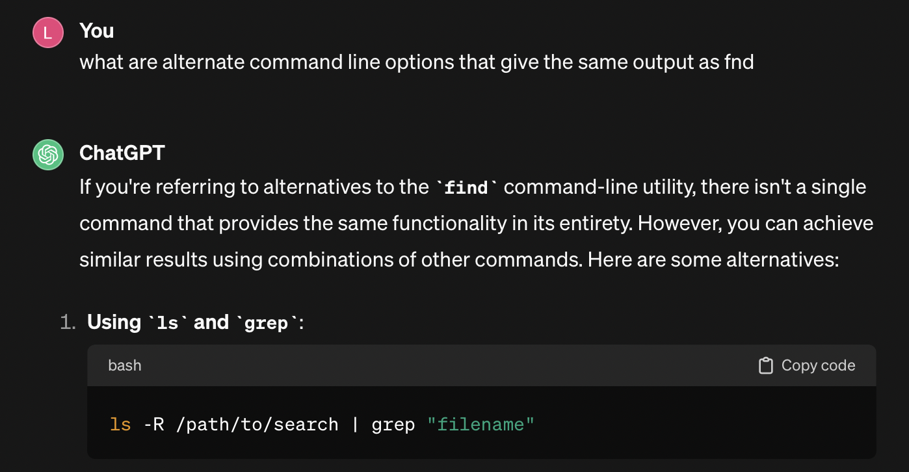
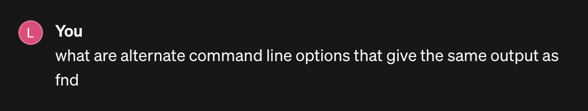
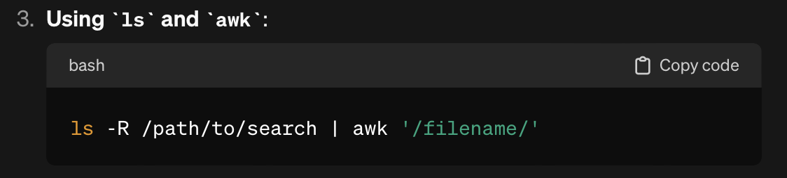

# Lab Report 3 - Bugs and Commands (Week 5)

## Part 1 - Bugs
I will address this buggy method:
```
// Changes the input array to be in reversed order
static void reverseInPlace(int[] arr) {
  for(int i = 0; i < arr.length; i += 1) {
    arr[i] = arr[arr.length - i - 1];
  }
}
```
A failure-inducing input for the `reverseInPlace()` method:
```
@Test
public void testReverseInPlace2() {
  int[] input = {1, 2, 3};
  ArrayExamples.reverseInPlace(input);
  assertArrayEquals(new int[] {3, 2, 1}, input);
}
```
An input that does not induce a failure for the `reverseInPlace()` method:
```
@Test 
public void testReverseInPlace() {
  int[] input1 = { 3 };
  ArrayExamples.reverseInPlace(input1);
  assertArrayEquals(new int[]{ 3 }, input1);
}
```
The symptom (the output of running the tests above):


<br/>The failure-inducing test can be seen above (first image) and the input that does not induce a visible failure is one of the 3 tests that passed (second image) out of a total of 4 tests.
<br/>Before the code was changed to fix the bug:
```
static void reverseInPlace(int[] arr) {
  for(int i = 0; i < arr.length; i += 1) {
    arr[i] = arr[arr.length - i - 1];
  }
}
```
After the code was changed to fix the bug:
```
static void reverseInPlace(int[] arr) {
  int[] arrCopy = new int[arr.length];
  for (int i = 0; i < arr.length; i++) {
    arrCopy[i] = arr[i];
  }
  for (int i = 0; i < arr.length; i+=1) {
    arr[i] = arrCopy[arr.length - i - 1];
  }
}
```
Previously, only the first half of the array was being successfully reversed and the second half of the array remained the same. This was because the for loop didn't take into account the array being updated (reversed) while the for loop ran. This code change fixes the issue of the array not being reversed properly because when the original array is being reversed now, it doesn't modify itself as it refers to its copy for the correct elements.

## Part 2 - Researching Commands
I will find 4 alternating ways to use the `find` command
1. `ls -R /path/to/search | grep "filename"` command: 
```
lavin@Lavins-MacBook-Air docsearch % ls -R technical/911report/ | grep "chapter-1.txt"
chapter-1.txt
```
```
lavin@Lavins-MacBook-Air docsearch % ls -R technical/911report/ | grep "chapter-2.txt"
chapter-2.txt
```
This command is useful because it can find the files with a specific text you are looking for quickly. The `s -R /path/to/search` recursively lists all the files/directories from the path given. Then the output is passed as an input to the next part through the pipe operator, `|`. The next part, `grep "filename"` searches for the lines containing the text "filename" and displays those lines. 
<br/>The prompt I gave chatGPT is shown below:

2. `ls -R /path/to/search | awk '/filename/'` command - 
```
lavin@Lavins-MacBook-Air docsearch % ls -R technical/911report | awk '/chapter-8.txt/'
```
```
chapter-8.txt
lavin@Lavins-MacBook-Air docsearch % ls -R technical/911report | awk '/preface/'      
preface.txt
```
This command is useful because it find the output in a straightforward manner and is easy to understand when seeing it being performed in the terminal. The `ls -R /path/to/search` recursively outputs a list of files and directories under the given path. This output is then passed as an input to the next part with the pipe operator, `|`. The `awk '/filename/'` portion of the command searches through the given input from the previous part for strings containing "filename" and prints the output.
<br/>The prompt I gave chatGPT is shown below:


3. 
