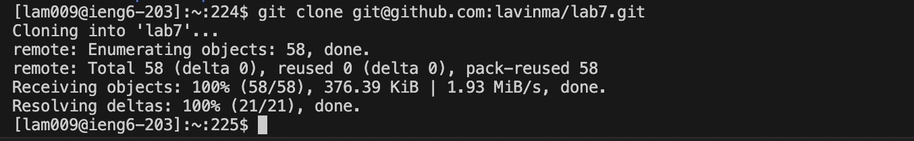
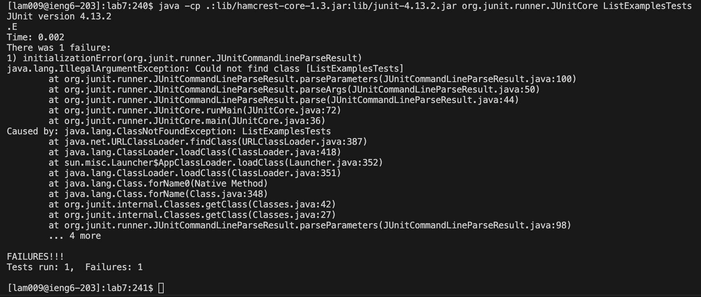

# Lab Report 4 - Vim (Week 7)

 Logging into ieng6: The keys I used to get to this point were `ssh<space>lam009@ieng6.ucsd.edu<enter>`. I typed that all into the terminal and was able to connect to the `ieng6` server with the `ssh` command using my UCSD specific login information. The `ssh` command stands for secure shell and connects two devices (in my case my computer to a server).

Cloned my fork of the repository from my Github account (using the SSH URL): The keys I used to get here were `git<space>clone<space>git@github.com:lavinma/lab7.git<enter>`. (The last part is the SSH URL.) I typed that into the terminal and was able to create a copy of my remote Github repository onto my computer with the  `git clone` command.

Run the tests, demonstrating that they fail: The keys I used to get here were `java -cp .:lib/hamcrest-core-1.3.jar:lib/junit-4.13.2.jar org.junit.runner.JUnitCore ListExamplesTests<enter>`. I ran the java tester file here (`ListExamplesTests`) and noticed that there was a failure.

Edit the code file to fix the failing test: To fix the failing test I had to go into the `ListExamples.java` file and edit the code in the `merge` method. To do that I used the following keys: `vim 

Run the tests, demonstrating that they now succeed:

Commit and push the resulting change to my Github account:
