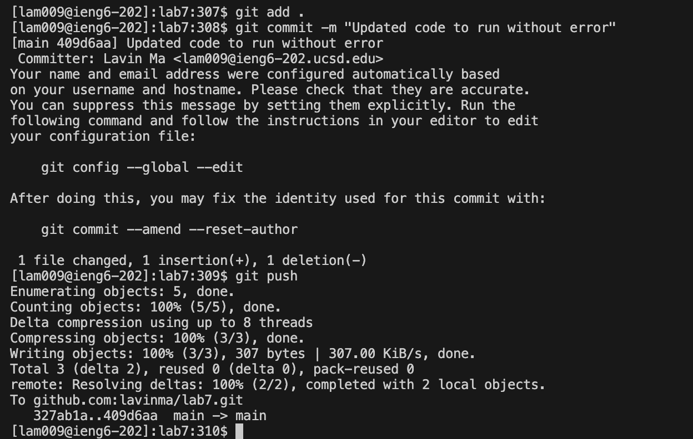

# Lab Report 4 - Vim (Week 7)

## Logging into ieng6:
The keys I used to get to this point were `ssh<space>lam009@ieng6-202.ucsd.edu<enter>`. I typed that all into the terminal and was able to connect to the `ieng6` server with the `ssh` command using my UCSD specific login information. The `ssh` command stands for secure shell and connects two devices (in my case my computer to a server).

## Cloned my fork of the repository from my Github account (using the SSH URL):
The keys I used to get here were `git<space>clone<space>git@github.com:lavinma/lab7.git<enter>`. (The last part is the SSH URL.) I typed that into the terminal and was able to create a copy of my remote Github repository onto my computer with the  `git clone` command.

## Run the tests, demonstrating that they fail:
The keys I used to get here were `bash<space>test.sh<enter>`. This ran the bash file that contained the commands to compile and run the `ListExamplesTests.java` file. It tested the code before I made edits in it through `vim`.
 Note: In order to access this bash script file, I had to change my directory to get there. I had to use the `cd lab7/` command line.

## Edit the code file to fix the failing test:
To fix the failing test I had to go into the `ListExamples.java` file and edit the code in the `merge` method. To do that I used the following keys: `vim ListExamples.java<enter>` to get into the `ListExamples.java` file to edit and fix the code. Since, I knew what to change I found the part using the `/` command. Next, I typed `/change <enter>` to get my cursor onto the comment above the part in the code I wanted to change. Then I pressed `j` to move my cursor down to the line of code I want to edit. At this point, my cursor is on the 'e' in 'index1' and I need to get it to be on '1', so I can delete it and repace it with '2'. So, then I do: `l` `l` `x` `a` `<left arrow>` `2`. That sequence of commands moved my cursor to be above the '1' in 'index1' and then I deleted the '1' with the `x` command and went into insert mode with the `a` command and typed '2' in the right place. Now I just needed to save my edits and quit `vim`. I did that using the following key presses: `<Control><C>` to go from insert mode to normal and `:wq<enter>` to save my edits and exit `vim`.
 Note: The image above depicts my code right before I pressed `<enter>` after I typed the `:wq` to save and exit. 

## Run the tests, demonstrating that they now succeed:
The keys I used to get here were `bash<space>test.sh<enter>`. This ran the bash file that contained the commands that would compile and run the `ListExamplesTests.java` file. It tested my edited code and now all the tests ran successfully, showing I made the correct changes to the code and it saved.

## Commit and push the resulting change to my Github account:
I used three commands in this final part. For the first command, I used the following keys: `git add .<enter>`. This command added all the changes I made in the directory and subdirectories to the staging area where Git prepares the changes to be committed. For the second command, I used the following keys: `git commit -m "Updated code to run without error"<enter>`. This command allowed me to have a commit message where I could describe the changes and updated I made in the code. For the third command, I used the following keys: `git push`. This command pushes all the changes I made to Github, so everything is updated between my local and remote repositories. 
