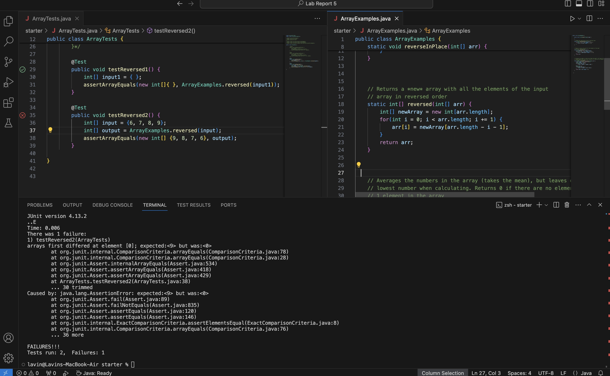
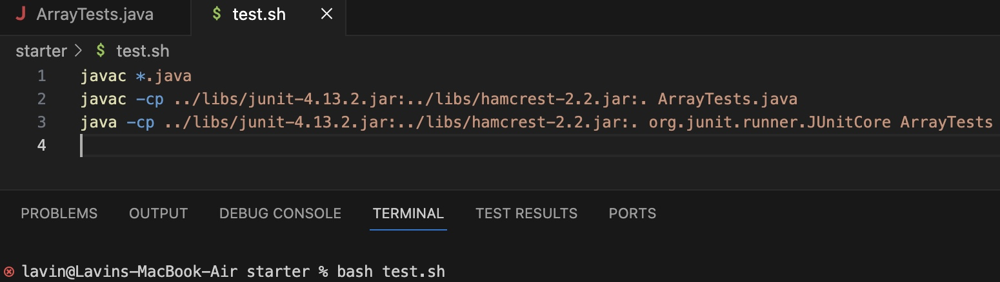
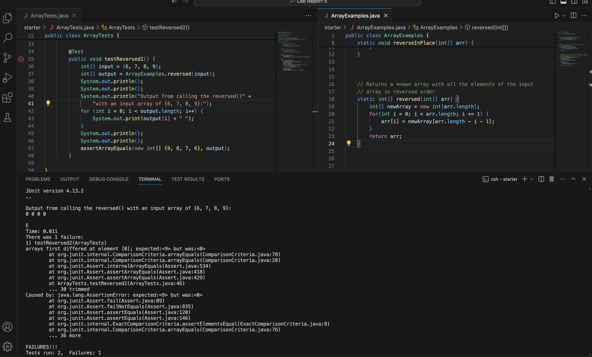

# Lab Report 5 - Putting It All Together (Week 9)

## Part 1 - Debugging Scenario
Original post from student depicting symptom and their intepretation of the bug/failure-inducing input:

"I am having issues with my implementation of the reversed() method. It is supposed to return a new array with the elements of the input array in reverse order. My test case (shown above) told me that the first element in my return array differs from my expected array. Originally I thought I returned the array with the elements in the original order, but my test case shows that the element at the first index is 0, which isn't even an element ever in my input array. I can see that the failure-inducing input is my test case named testReversed2(), but I am still unsure of what the bug may be. Also, the command line I ran that triggered this bug was `bash test.sh`. `test.sh` was the bash scipt I created that compiled and ran ArrayTests.java for me."

TA response:
"Have you tried fully printing out the returned array you get from calling reversed()? Perhaps that could help you with debugging and fixing your method implementation."

Student response:

"I tried your suggestion and I have a good idea of what my bug is now! Thanks!! Since the outpute I am getting from the method call is an array with 0 as each of its four elements, I can see now that the bug is I am returning an array that is never initialized to anything. I took another look at my method implementation and noticed  a few different bugs. First, I am setting my input array to the reversed order of elements in the new array I initialized (the elements in the new array are all 0). Second, I am returning my input array instead of the new array I initialized. I will fix my bug in the code by setting each element in `newArray` to elements in `arr` (the input array) in reverse order and then return `newArray` at the end of my code." 

