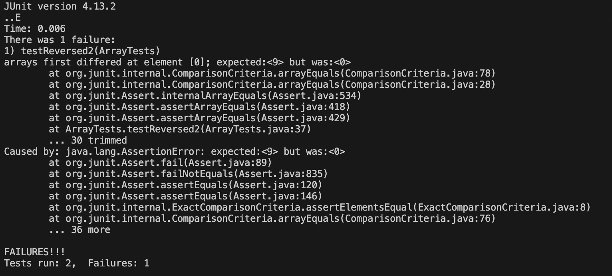

# Lab Report 5 - Putting It All Together (Week 9)

## Part 1 - Debugging Scenario
Original post from student depicting symptom and their intepretation of the bug/failure-inducing input:

"I am having issues with my implementation of the reversed() method. It is supposed to return a new array with the elements of the input array in reverse order. My test case (shown above) told me that the first element in my return array differs from my expected array. Originally I thought I returned the array with the elements in the original order, but my test case shows that the element at the first index is 0, which isn't even an element ever in my input array. I can see that the failure-inducing input is my test case named testReversed2(), but I am still unsure of what the bug may be."

 
TA response:
"Have you tried fully printing out the returned array you get from calling reversed()? Perhaps that could help you with debugging and fixing your method implementation."

 
Student response:

